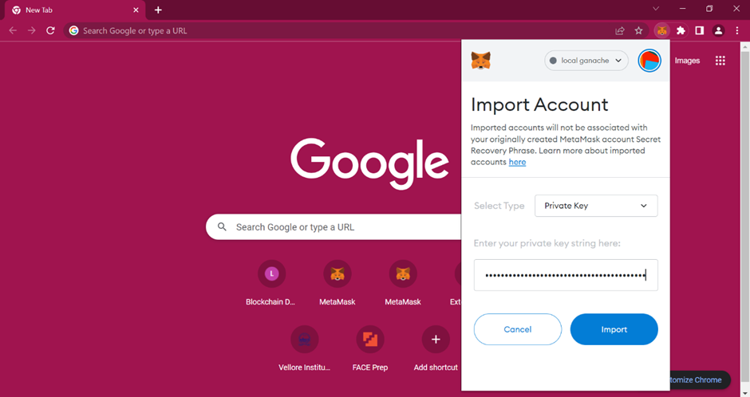

# Smart Garbage Monitoring System with Blockchain Integration

## Overview

This project involves creating a **Smart Garbage Monitoring System** that monitors waste levels in garbage bins in real-time. It sends SMS notifications to the municipality when bins are full or nearly full. Additionally, it leverages **blockchain technology** to securely store the data from IoT sensors, ensuring privacy and tamper-proof record-keeping.

## Features

- **Real-time monitoring** of garbage bins using **Ultrasonic Sensors** to detect the waste levels.
- **GPS Module** to track the location of each garbage bin.
- **SMS Notifications** to the municipality when the bins are full or nearly full, using the **GSM Module**.
- **Blockchain-based Data Security**: Utilizes **blockchain technology** to securely store sensor data in tamper-proof blocks, ensuring privacy and traceability.
- **Decentralized Architecture**: Implements a decentralized structure to lower costs, increase transparency, and provide greater traceability.
- **ThinkSpeak Server**: Cloud storage for sensor data.
- **Arduino**: Controls the hardware components and sends data to the NodeMCU.

## Hardware Components

- **Arduino**: Controls the system and interfaces with sensors and modules.
- **Ultrasonic Sensor**: Measures the level of waste in the bin.
- **GPS Module**: Tracks the location of the garbage bin.
- **GSM Module**: Sends SMS alerts to the municipality when the bin reaches full capacity.
- **NodeMCU**: Connects the system to the internet and sends data to the cloud and blockchain.

## Software Components

- **Blockchain Technology**: Utilizes **Ethereum** (Truffle, Ganache, MetaMask) to securely store data in a decentralized ledger.
- **Python**: Used for storing data on the blockchain and implementing the system’s logic.
- **ThinkSpeak**: Cloud platform used to store sensor data.
- **IFTTT**: Used for sending alerts when the waste level reaches a threshold.
- **Arduino Code**: Runs on the Arduino board to manage sensor readings and communicate with other components.

## Methodology

1. **Data Collection**: The system collects real-time data from the ultrasonic sensor and GPS module via the Arduino.
2. **Data Storage**: Data from the sensors is sent to the **ThinkSpeak** server.
3. **SMS Notification**: When the garbage bin is full, the system sends an SMS notification to the municipality using the GSM module.
4. **Blockchain Security**: Data from the sensors is stored securely on the **blockchain** to ensure data integrity and traceability.
5. **Blockchain Integration**: The system is decentralized using **Truffle, Ganache, and MetaMask** to deploy and manage smart contracts on the Ethereum blockchain.

## Setup and Installation

### Prerequisites

- **Hardware**: Arduino, NodeMCU, Ultrasonic Sensor, GPS Module, GSM Module.
- **Software**: Python, Truffle, Ganache, MetaMask, ThinkSpeak Account, Arduino IDE.

### Steps

1. **Hardware Setup**:
   - Connect the Ultrasonic sensor, GPS module, and GSM module to the Arduino and NodeMCU as per the wiring diagram.
   - Ensure the NodeMCU is connected to a Wi-Fi network for internet connectivity.

2. **Software Setup**:
   - Install **Arduino IDE** and configure the code to read data from the sensors.
   - Set up **ThinkSpeak** account and configure the API for storing sensor data.
   - Initialize **Truffle** and deploy smart contracts using **Ganache** and **MetaMask**.
   
3. **Blockchain Integration**:
   - Write a Python script that stores the collected sensor data into blockchain using the `web3` library.
   - Use smart contracts to securely store the data, ensuring it is tamper-proof and traceable.

4. **SMS Notifications**:
   - Use the **GSM Module** to send SMS alerts to the municipality when the waste bin is full.
   - Set up thresholds in the Python script to trigger SMS based on ultrasonic sensor data.

## Technologies Used

- **IoT**: Arduino, NodeMCU, Ultrasonic Sensors, GPS Module, GSM Module
- **Blockchain**: Ethereum (Truffle, Ganache, MetaMask)
- **Cloud**: ThinkSpeak, IFTTT
- **Programming**: Python, Arduino

## Future Improvements

- **Automated Waste Collection**: Integrate autonomous vehicles for waste collection based on data from the monitoring system.
- **AI Integration**: Use machine learning to predict waste generation patterns and optimize collection routes.
- **Real-time Analytics**: Implement real-time data analytics for better decision-making and resource management.

## Snapshots

Fig 1: Arduino Hardware Connections

Fig 2: Arduino Code verified

Fig 3: Sensed data displayed on serial monitor

Fig 4: Turn on ganache

Fig 5: Copy the private key 

Fig 6: Turn on Metamask

Fig 7: paste the private key in the metamask

Fig 8: Account created

Fig 9: truffle migrate

Fig 10: Blocks get created

Fig 11:Ethereum present in the account

Fig 12:Blocks creation

Fig 13:Run the web application

Fig 14: Connect the account to the website running

Fig 15: Metamask asks for a confirmation

Fig 16: Device gets added

Fig 17: Sensed data gets stored in the field chart

Fig 19: SMS sent to registered mobile number